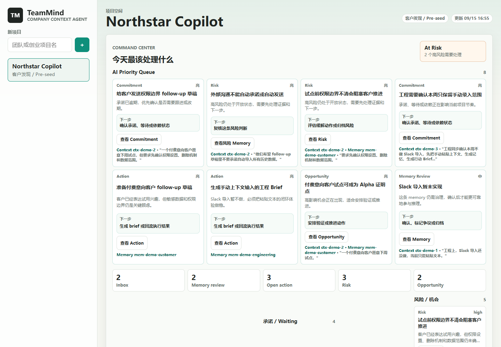
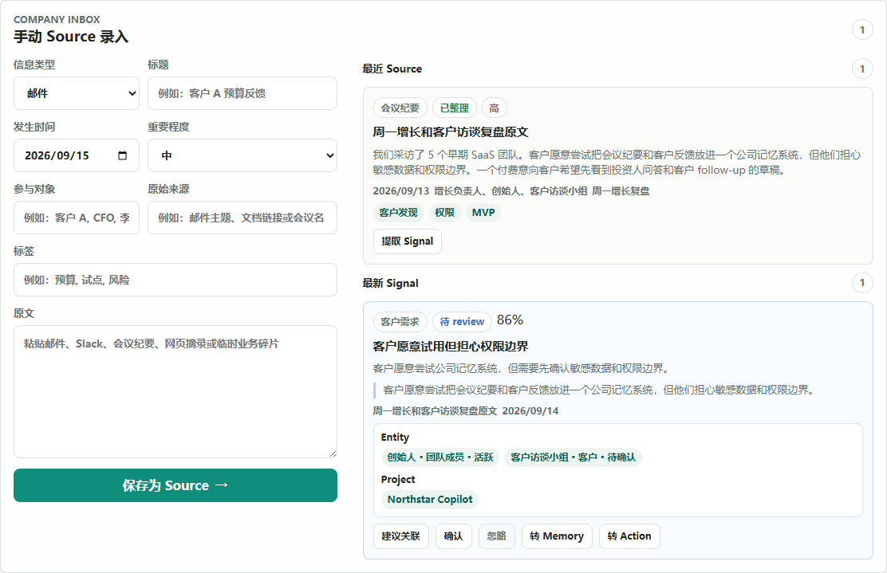

# TeamMind · 从团队上下文到下一步行动

本地确定性工作流原型。把会议纪要、客户反馈与工程进度收进同一个工作台，关联长期记忆、行动简报和执行结果。

我围绕“下一步行动能否保留它的来由”设计信息模型与产品流程：来源进入收件箱，提取信号，关联实体与项目，形成可编辑 Brief；执行结果再写回记忆和后续行动。记忆支持确认、过期、争议与归档，行动保留来源和人工检查项。

## 体验

需要 Node.js 22（测试）和 Python 3（本地服务）。项目使用原生 JavaScript，无需安装 npm 依赖。

```bash
git clone https://github.com/skeleton2024/team-brain.git
cd team-brain
node scripts/smoke-test.mjs
python -m http.server 4173
```

打开 http://localhost:4173 。加载示例工作区，依次查看收件箱、记忆、行动 Brief，再记录一次执行结果并回到总览。浏览器 localStorage 保存当前工作区。





## 实现与取舍

- Source、Signal、Memory、Entity、Project、Action、Brief、Result 分别建模，沿来源串起处理过程。
- 本地规则引擎生成建议，便于反复检查状态迁移和界面反馈。
- 客户跟进、投资人回复、开发任务使用不同简报结构。
- localStorage 支持持久化、旧数据迁移及异常恢复。

## 代码与设计

- [产品定义](PRD.md) · [数据模型](DATA_MODEL.md)
- [功能结构](PROJECT_FUNCTION_STRUCTURE.md) · [迭代记录](docs/TEAM_DEV_LOG.md)
- 核心引擎：`src/domain/agentEngine.js`；持久化：`src/services/store.js`
- 验证入口：`scripts/smoke-test.mjs`

## 许可

见 [RIGHTS.md](RIGHTS.md)。
